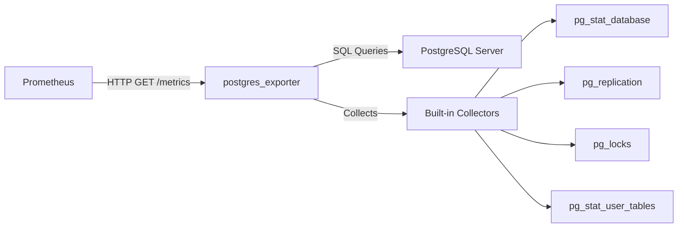

## Overview

PostgreSQL Server Exporter is a Prometheus exporter that exposes comprehensive metrics from PostgreSQL database servers. It provides deep visibility into database performance, replication status, query statistics, and operational health metrics.

Built and maintained by the Prometheus Community, this exporter is production-ready and widely deployed for monitoring PostgreSQL infrastructure at scale.

## Why PostgreSQL Server Exporter?

PostgreSQL Server Exporter solves critical challenges in database observability:

<CardGroup cols={2}>
  <Card title="Comprehensive Metrics" icon="chart-line">
    Exposes 20+ built-in collectors covering database statistics, replication lag, locks, WAL activity, and query performance
  </Card>
  <Card title="Production-Ready" icon="shield-check">
    Battle-tested across thousands of deployments with support for PostgreSQL versions 13-18
  </Card>
  <Card title="Multi-Target Support" icon="server">
    Monitor multiple PostgreSQL instances from a single exporter using the multi-target pattern
  </Card>
  <Card title="Flexible Deployment" icon="cubes">
    Deploy as Docker container, binary, sidecar, or centralized service with configurable authentication
  </Card>
</CardGroup>

## Key Features

### Built-in Collectors

The exporter includes comprehensive collectors that are enabled by default:

- **Database Statistics**: Transactions, block reads/writes, deadlocks, conflicts
- **Replication Monitoring**: Replication lag in bytes, slot status, WAL sender state  
- **Lock Analysis**: Lock types, counts, and wait states
- **Table Statistics**: Sequential scans, index usage, vacuum/analyze status
- **WAL Activity**: Write-ahead log generation rate and location
- **Background Writer**: Checkpoint statistics and buffer allocation
- **Query Performance**: pg_stat_statements integration for top queries (optional)

### Optional Collectors

Enable additional collectors for specific monitoring needs:

- `database_wraparound`: Transaction ID wraparound monitoring
- `long_running_transactions`: Detect queries running beyond thresholds
- `stat_activity_autovacuum`: Autovacuum progress tracking
- `stat_checkpointer`: Checkpoint timing and I/O statistics
- `stat_statements`: Top queries by execution time and frequency
- `process_idle`: Idle connection tracking
- `postmaster`: PostgreSQL server process information

### Multi-Target Pattern (Beta)

Monitor multiple PostgreSQL servers from a single exporter instance:

```yaml
scrape_configs:
  - job_name: 'postgres'
    static_configs:
      - targets:
        - server1:5432
        - server2:5432
    metrics_path: /probe
    params:
      auth_module: [production]
    relabel_configs:
      - source_labels: [__address__]
        target_label: __param_target
      - source_labels: [__param_target]
        target_label: instance
      - target_label: __address__
        replacement: postgres-exporter:9187
```

### Secure Authentication

Multiple authentication methods protect sensitive credentials:

- Environment variables (`DATA_SOURCE_URI`, `DATA_SOURCE_USER`, `DATA_SOURCE_PASS`)
- File-based secrets (`DATA_SOURCE_PASS_FILE`, `DATA_SOURCE_USER_FILE`)
- Configuration file with reusable auth modules
- Support for all PostgreSQL connection parameters (SSL, timeouts, etc.)

### Non-Superuser Support

Run with minimal privileges using PostgreSQL's built-in monitoring roles:

```sql
-- PostgreSQL 10+
GRANT pg_monitor TO postgres_exporter;

-- PostgreSQL 9.x requires custom functions
CREATE SCHEMA postgres_exporter;
GRANT USAGE ON SCHEMA postgres_exporter TO postgres_exporter;
```

## Supported PostgreSQL Versions

<Note>
  The exporter is CI-tested against PostgreSQL versions **13, 14, 15, 16, 17, and 18**.
  
  PostgreSQL 9.1+ is supported with reduced functionality. Some collectors require newer versions.
</Note>

## Architecture

The exporter connects directly to PostgreSQL using the standard `lib/pq` driver:



The exporter:
1. Receives scrape requests from Prometheus on port 9187
2. Executes SQL queries against PostgreSQL system catalogs and statistics views
3. Transforms results into Prometheus metrics format
4. Caches connections between scrapes for efficiency
5. Supports version-specific query optimization

## Metrics Endpoint

The exporter exposes metrics on port **9187** by default:

- **`/metrics`**: Primary metrics endpoint (configurable path)
- **`/probe`**: Multi-target probe endpoint for monitoring multiple servers
- **`/`**: Landing page with version info and links

<CodeGroup>

```bash Standard Metrics
curl http://localhost:9187/metrics
```

```bash Multi-Target Probe
curl "http://localhost:9187/probe?target=postgres-server:5432&auth_module=prod"
```

</CodeGroup>

## Performance Characteristics

<CardGroup cols={2}>
  <Card title="Collection Timeout" icon="clock">
    Default 1-minute timeout prevents hung queries from blocking scrapes
  </Card>
  <Card title="Connection Pooling" icon="diagram-project">
    Reuses database connections between scrapes for low overhead
  </Card>
  <Card title="Selective Collectors" icon="filter">
    Enable only needed collectors to minimize database load
  </Card>
  <Card title="Version Optimization" icon="bolt">
    Automatically uses optimal queries based on PostgreSQL version
  </Card>
</CardGroup>

## Get Started

<CardGroup cols={2}>
  <Card
    title="Quick Start"
    icon="rocket"
    href="/quickstart"
  >
    Get the exporter running in minutes with Docker
  </Card>
  <Card
    title="Installation Guide"
    icon="download"
    href="/installation"
  >
    Detailed installation methods for all deployment scenarios
  </Card>
  <Card
    title="Configuration Reference"
    icon="gear"
    href="/configuration/overview"
  >
    Complete guide to collectors, flags, and environment variables
  </Card>
  <Card
    title="Multi-Target Setup"
    icon="network-wired"
    href="/advanced/multi-target"
  >
    Configure centralized monitoring for multiple PostgreSQL servers
  </Card>
</CardGroup>

## Use Cases

### Database Performance Monitoring

Track query throughput, cache hit ratios, and transaction rates to optimize database performance.

### Replication Lag Alerting

Monitor replication lag in bytes (`pg_wal_lsn_diff`) to detect and prevent replica drift.

### Capacity Planning

Analyze connection counts, disk I/O patterns, and table growth trends for infrastructure planning.

### Incident Response

Investigate lock contention, long-running transactions, and autovacuum issues during outages.

## Community & Support

<CardGroup cols={2}>
  <Card
    title="GitHub Repository"
    icon="github"
    href="https://github.com/prometheus-community/postgres_exporter"
  >
    Report issues, contribute code, or view the source
  </Card>
  <Card
    title="Docker Hub"
    icon="docker"
    href="https://hub.docker.com/r/prometheuscommunity/postgres-exporter"
  >
    Official Docker images published by the Prometheus Community
  </Card>
</CardGroup>

<Note>
  **Next Steps**: Follow the [Quick Start](/quickstart) guide to deploy your first exporter instance in under 5 minutes.
</Note>